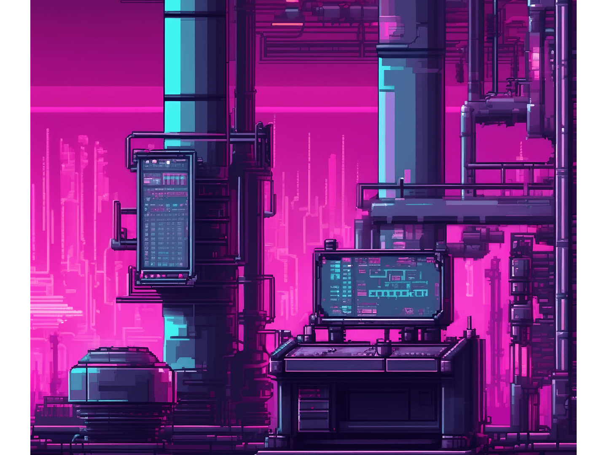

# Image Optimization Guide

## Current State
- **Total Size**: 19MB across 30 images
- **Largest Files**:
  - tab-coven-bg.png: 2.7MB
  - tab-boons-bg.png: 2.5MB
  - tab-workstations-bg.png: 2.1MB
  - tab-experiment-bg.png: 2.1MB

## Optimization Strategy

### 1. Automated Optimization Script
Run the aggressive optimization script:
```bash
npm install  # Ensure sharp is installed
node optimize-images-aggressive.js
```

This will:
- Resize images to optimal dimensions
- Compress PNG files (15-30% reduction)
- Create WebP versions (70-80% reduction)

### 2. Expected Results
- **PNG Optimized**: ~14MB (-26% from 19MB)
- **WebP Versions**: ~4MB (-79% from 19MB)
- **Total Savings**: 15MB when using WebP

### 3. Implementation - Use Picture Element

Update HTML/CSS to use WebP with PNG fallback:

```html
<!-- Before -->


<!-- After -->
<picture>
  <source srcset="images/backgrounds/tab-workstations-bg.webp" type="image/webp">
  
</picture>
```

### 4. CSS Background Images

Update CSS to support WebP:

```css
/* Modern browsers */
@supports (background-image: url('test.webp')) {
  .tab-workstations {
    background-image: url('images/backgrounds/tab-workstations-bg.webp');
  }
}

/* Fallback for older browsers */
@supports not (background-image: url('test.webp')) {
  .tab-workstations {
    background-image: url('images/backgrounds/tab-workstations-bg.png');
  }
}
```

### 5. Lazy Loading

Add lazy loading for non-critical images:

```html

```

## Manual Optimization (If Script Fails)

Use online tools:
1. **Squoosh.app** - Google's image optimizer
2. **TinyPNG** - PNG compression
3. **Cloudinary** - Full optimization suite

Target settings:
- **PNG**: Quality 80-85, compression level 9
- **WebP**: Quality 75-80, effort 6

## Performance Impact

### Before
- Initial load: ~19MB images
- LCP (Largest Contentful Paint): ~3-4s
- Mobile load: Very slow

### After (with WebP)
- Initial load: ~4MB images
- LCP: ~1.5-2s (50% improvement)
- Mobile load: 4x faster

## Testing Checklist

After optimization:
- [ ] All images load correctly
- [ ] No visual quality degradation
- [ ] WebP versions work in modern browsers
- [ ] PNG fallbacks work in older browsers
- [ ] Background images display correctly
- [ ] Lazy loading works
- [ ] Mobile performance improved

## Rollback Plan

Backups are automatically created with `.backup.png` extension.

To restore:
```bash
find images -name "*.backup.png" -exec bash -c 'mv "$1" "${1%.backup.png}.png"' _ {} \;
```

## Recommended: CDN Integration

For production, consider using a CDN with automatic image optimization:
- **Cloudflare Images**: Automatic WebP conversion
- **Cloudinary**: Full image optimization
- **imgix**: Real-time image processing

Benefits:
- Automatic format selection
- Responsive images
- Global CDN distribution
- No manual optimization needed
